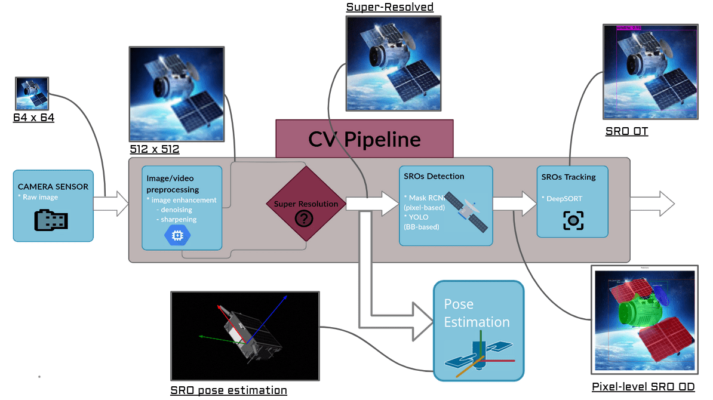
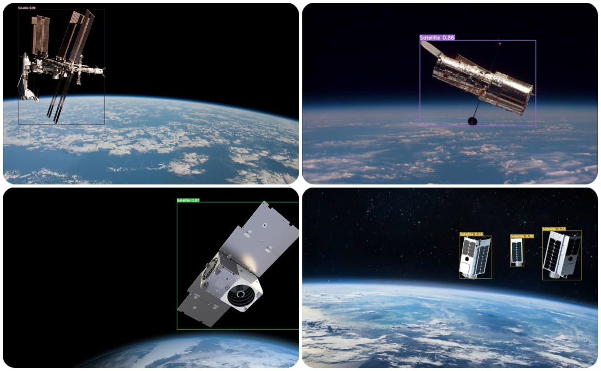

# Space-Intelligence-Vision-and-Analytics

This project is a demonstration of futuristic space technological capability that will allow our assets in space orbits to detect and track space resident objects (SROs), giving space assets the ability to see, sense nearby orbital environments and act autonomously. This project focuses on the computer vision part of the problem statement by implementing image/video enhancing techniques, object detection, instance segmentation, tracking algorithms, and
pose estimation of satellites in space in a single computer vision pipeline.

    

The algorithms used are [Yolov7][yolov7_github], [DeepSORT][deepsort_github] and other image and video pre-processing using classical as well as deep learning based techinques.

## Detections

The detection pipeline inferences with [Yolov7][yolov7_github]:

    

[yolov7_github]: https://github.com/WongKinYiu/yolov7
[deepsort_github]: https://github.com/nwojke/deep_sort
[mask_rcnn]: https://github.com/matterport/Mask_RCNN
[SR3]: https://iterative-refinement.github.io/

## TO DO
1. Tracking with [DeepSORT][deepsort_github]
2. Segmentation with [MaskRCNN][mask_rcnn]
3. Super resolution with [Super Resolution with Image superresolution via iterative refinement][SR3]

## References

[1] H. A. Dung, B. Chen, and T.-J. Chin, “A spacecraft dataset for detection, segmentation and parts recognition,” in Proceedings of the IEEE/CVF Conference on Computer Vision and Pattern Recognition, 2021, pp. 2012–2019.
[2] M. Kisantal, S. Sharma, T. H. Park, D. Izzo, M. Märtens, and S. D’Amico, “Satellite
pose estimation challenge: Dataset, competition design, and results,” IEEE Transac tions on Aerospace and Electronic Systems, vol. 56, no. 5, pp. 4083–4098, 2020.
[3] T. H. Park, M. Märtens, G. Lecuyer, D. Izzo, and S. D’Amico, “Speed+: Next geeration dataset for spacecraft pose estimation across domain gap,” arXiv preprint arXiv:2110.03101, 2021.
[4] P. F. Proença and Y. Gao, “Deep learning for spacecraft pose estimation from photo realistic rendering,” in 2020 IEEE International Conference on Robotics and Automation (ICRA). IEEE, 2020, pp. 6007–6013.
[5] A. Buades, B. Coll, and J.-M. Morel, “Non-local means denoising,” Image Processing On Line, vol. 1, pp. 208–212, 2011.
[6] C. Saharia, J. Ho, W. Chan, T. Salimans, D. J. Fleet, and M. Norouzi, “Image superresolution via iterative refinement,” arXiv preprint arXiv:2104.07636, 2021.
[7] Z. Wang, A. C. Bovik, H. R. Sheikh, and E. P. Simoncelli, “Image quality assessment: from error visibility to structural similarity,” IEEE transactions on image processing, vol. 13, no. 4, pp. 600–612, 2004.
[8] A. Bochkovskiy, C.-Y. Wang, and H.-Y. M. Liao, “Yolov4: Optimal speed and accuracy of object detection,” arXiv preprint arXiv:2004.10934, 2020.
[9] K. He, G. Gkioxari, P. Dollár, and R. Girshick, “Mask r-cnn,” in Proceedings of the IEEE international conference on computer vision, 2017, pp. 2961–2969.
[10] A. Bewley, Z. Ge, L. Ott, F. Ramos, and B. Upcroft, “Simple online and realtime tracking,” in 2016 IEEE international conference on image processing (ICIP). IEEE,2016, pp. 3464–3468.
[11] N. Wojke, A. Bewley, and D. Paulus, “Simple online and realtime tracking with a deep association metric,” in 2017 IEEE international conference on image processing (ICIP). IEEE, 2017, pp. 3645–3649.
